# 🌐 Cloudflare + AWS Integration Guide

## **Using Your Cloudflare Domain with AWS Services**

This guide covers the best practices for integrating your Cloudflare-managed domain with AWS services while maintaining optimal performance and cost efficiency.

---

## 🎯 **Integration Strategy Overview**

### **Option 1: Cloudflare as Primary CDN (Recommended)**
- **Best for**: Cost optimization, DDoS protection, advanced features
- **Cloudflare**: Handles DNS, CDN, WAF, DDoS protection
- **AWS**: Provides compute (ECS), storage (S3), databases

### **Option 2: AWS Route53 + CloudFront**
- **Best for**: Full AWS ecosystem, ACM integration
- **AWS**: Full DNS and CDN management
- **Cloudflare**: Domain registration only

### **Option 3: Hybrid Approach**
- **Best for**: Maximum flexibility
- **Mix**: Use best features from both platforms

---

## 🏆 **Recommended: Cloudflare as Primary CDN**

### **Why This Approach?**
- ✅ **Cost Effective**: Cloudflare CDN is often cheaper than CloudFront
- ✅ **DDoS Protection**: Industry-leading protection included
- ✅ **Advanced Features**: WAF, bot management, analytics
- ✅ **Global Performance**: 250+ edge locations worldwide
- ✅ **Easy SSL**: Free SSL certificates with automatic renewal

---

## 🔧 **Implementation: Cloudflare + AWS Setup**

### **1. DNS Configuration in Cloudflare**

#### **A. Point Subdomain to AWS Load Balancer**
```dns
# In Cloudflare DNS Management:
Type: CNAME
Name: api (or app, www, etc.)
Value: your-aws-alb-dns-name.us-east-2.elb.amazonaws.com
Proxy: 🟠 Proxied (for CDN) or 🟤 DNS Only (direct to AWS)
TTL: Auto
```

#### **B. Root Domain Configuration**
```dns
# For root domain (yourdomain.com):
Type: CNAME
Name: @ (root)
Value: your-aws-alb-dns-name.us-east-2.elb.amazonaws.com
Proxy: 🟠 Proxied
TTL: Auto
```

#### **C. Environment-Specific Subdomains**
```dns
# Development
dev.yourdomain.com → dev-alb.us-east-2.elb.amazonaws.com

# Staging  
staging.yourdomain.com → staging-alb.us-east-2.elb.amazonaws.com

# Production
yourdomain.com → prod-alb.us-east-2.elb.amazonaws.com
api.yourdomain.com → prod-alb.us-east-2.elb.amazonaws.com
```

---

## 🚀 **Step-by-Step Setup**

### **Step 1: Deploy AWS Infrastructure**
```bash
# Deploy your AWS infrastructure first
cd /home/daclab-work001/DEV/AWS-DevOps/infrastructure/terraform
./deploy.sh dev apply

# Get the Load Balancer DNS name
terraform output web_application_load_balancer_dns
# Output: aws-devops-dev-alb-1234567.us-east-2.elb.amazonaws.com
```

### **Step 2: Configure Cloudflare DNS**

1. **Login to Cloudflare Dashboard**
2. **Select Your Domain**
3. **Go to DNS Management**
4. **Add CNAME Records**:

```dns
# Development Environment
Type: CNAME
Name: dev
Value: aws-devops-dev-alb-1234567.us-east-2.elb.amazonaws.com
Proxy: 🟠 Proxied
```

### **Step 3: SSL Configuration**

#### **Option A: Cloudflare SSL (Recommended)**
```bash
# In Cloudflare:
# 1. Go to SSL/TLS → Overview
# 2. Set mode to "Full (strict)" or "Full"
# 3. Enable "Always Use HTTPS"
# 4. Enable "Automatic HTTPS Rewrites"
```

#### **Option B: AWS ACM + Cloudflare**
```terraform
# If you want AWS ACM certificates:
# Note: ACM certificates work with CloudFront, not directly with ALB when using Cloudflare proxy
```

---

## ⚙️ **Updated Terraform Configuration**

### **Update Your Variables**
```terraform
# In terraform.dev.tfvars
web_app_domain_name = "dev.yourdomain.com"

# For staging
web_app_domain_name = "staging.yourdomain.com"

# For production  
web_app_domain_name = "yourdomain.com"
```

### **Disable CloudFront (Since Using Cloudflare)**
```terraform
# In web-application.tf local configuration:
development = {
  enable_cloudfront = false  # Cloudflare handles CDN
  domain_name      = "dev.yourdomain.com"
  enable_https     = true    # Cloudflare handles SSL
}
```

---

## 🔐 **SSL Certificate Strategies**

### **Strategy 1: Cloudflare Universal SSL (Easiest)**
```yaml
Configuration:
  - Cloudflare: Handles client → Cloudflare SSL
  - AWS ALB: HTTP or self-signed cert for Cloudflare → AWS
  - Cost: Free
  - Setup: Automatic
```

### **Strategy 2: Cloudflare + AWS ACM**
```yaml
Configuration:
  - Cloudflare: Client → Cloudflare (Cloudflare cert)
  - AWS ALB: Cloudflare → AWS (ACM cert)
  - Cost: Free (both certs)
  - Setup: Manual ACM validation
```

### **Strategy 3: Full End-to-End**
```yaml
Configuration:
  - Cloudflare: Client → Cloudflare (Cloudflare cert)
  - AWS ALB: Cloudflare → AWS (Valid SSL cert)
  - Cost: Free with Let's Encrypt or ACM
  - Security: Maximum
```

---

## 📊 **Performance Optimization**

### **Cloudflare Settings for AWS Integration**

#### **Speed Optimizations**
```yaml
# In Cloudflare Dashboard:
Speed:
  - Auto Minify: Enable JS, CSS, HTML
  - Brotli: Enable
  - Early Hints: Enable
  - Image Optimization: Enable (Polish)
  - Mirage: Enable (for mobile)
  - Rocket Loader: Enable (with testing)
```

#### **Caching Rules**
```yaml
# Page Rules (example):
dev.yourdomain.com/api/*:
  - Cache Level: Bypass
  - Security Level: Medium
  
dev.yourdomain.com/static/*:
  - Cache Level: Cache Everything
  - Edge Cache TTL: 1 month
  - Browser Cache TTL: 1 day
```

---

## 🛡️ **Security Configuration**

### **WAF Rules for AWS Integration**
```yaml
# Cloudflare WAF Custom Rules:
Rule 1 - Allow Health Checks:
  - If: (http.request.uri.path contains "/health")
  - Then: Allow

Rule 2 - Rate Limiting:
  - If: (http.request.uri.path contains "/api/")
  - Then: Rate limit (100 requests/minute)

Rule 3 - Block Bot Traffic:
  - If: (cf.bot_management.score < 30)
  - Then: Challenge
```

### **DDoS Protection**
```yaml
# Cloudflare automatically provides:
- L3/L4 DDoS Protection: Automatic
- L7 DDoS Protection: Automatic  
- Rate Limiting: Configurable
- Bot Management: Available
```

---

## 🔄 **Deployment Workflow**

### **Multi-Environment Setup**
```bash
# 1. Deploy AWS environments
./deploy.sh dev apply
./deploy.sh staging apply
./deploy.sh prod apply

# 2. Get ALB DNS names
terraform output -json | jq '.web_application_load_balancer_dns'

# 3. Configure Cloudflare DNS records
# dev.yourdomain.com → dev-alb-dns-name
# staging.yourdomain.com → staging-alb-dns-name
# yourdomain.com → prod-alb-dns-name
```

### **Testing Your Setup**
```bash
# Test DNS resolution
nslookup dev.yourdomain.com

# Test SSL
curl -I https://dev.yourdomain.com

# Test application
curl https://dev.yourdomain.com/health
```

---

## 📈 **Monitoring & Analytics**

### **Cloudflare Analytics**
- **Traffic Analytics**: Real-time visitor data
- **Security Events**: Attack attempts and blocks
- **Performance**: Page load times and optimization opportunities
- **Caching**: Cache hit rates and performance

### **AWS CloudWatch**
- **ALB Metrics**: Request counts, response times, error rates
- **ECS Metrics**: CPU/memory utilization, task health
- **Custom Metrics**: Application-specific monitoring

---

## 💰 **Cost Comparison**

### **Cloudflare + AWS vs Pure AWS**

| Service | Cloudflare + AWS | Pure AWS | Savings |
|---------|------------------|----------|---------|
| **CDN** | Free (Cloudflare) | $5-50/month (CloudFront) | $5-50/month |
| **DDoS Protection** | Free | $3000/month (Shield Advanced) | $3000/month |
| **WAF** | $5/month | $1-100/month | Varies |
| **SSL Certificates** | Free | Free (ACM) | Equal |
| **DNS** | Free | $0.50/zone + queries | ~$5/month |
| **Total Savings** | | | **$50-3055/month** |

---

## 🚨 **Important Considerations**

### **Things to Remember**

#### **✅ Advantages of Cloudflare + AWS**
- Significant cost savings on CDN and DDoS protection
- Better global performance (more edge locations)
- Advanced security features included
- Easy SSL management
- Powerful analytics and insights

#### **⚠️ Potential Challenges**
- Additional complexity in troubleshooting
- Need to manage two different dashboards
- Some AWS services work better with Route53
- CloudFormation/CDK integration requires custom resources

#### **🔧 AWS Services That Need Special Attention**
- **API Gateway**: Works fine, but consider regional endpoints
- **SES**: Email authentication records need DNS setup
- **Certificate Manager**: Less useful when Cloudflare handles SSL
- **CloudFormation**: Custom resources needed for Cloudflare automation

---

## 📋 **Quick Setup Checklist**

### **Pre-Deployment**
- [ ] Domain is active in Cloudflare
- [ ] SSL mode set to "Full" or "Full (strict)"
- [ ] Always Use HTTPS enabled

### **AWS Deployment**
- [ ] Deploy infrastructure with `./deploy.sh dev apply`
- [ ] Get Load Balancer DNS name from outputs
- [ ] Verify health checks are working

### **Cloudflare Configuration**
- [ ] Add CNAME record pointing to ALB
- [ ] Enable proxy (orange cloud) for CDN benefits
- [ ] Configure page rules for caching
- [ ] Set up security rules if needed

### **Testing**
- [ ] Test DNS resolution: `nslookup yourdomain.com`
- [ ] Test SSL: `curl -I https://yourdomain.com`
- [ ] Test application: Visit URL in browser
- [ ] Verify Cloudflare analytics are working

---

## 🎯 **Recommended Architecture**

```mermaid
graph TB
    Users[👥 Users] --> CF[🌐 Cloudflare CDN]
    CF --> ALB[⚖️ AWS Application Load Balancer]
    ALB --> ECS1[🐳 ECS Task 1]
    ALB --> ECS2[🐳 ECS Task 2]
    ALB --> ECS3[🐳 ECS Task N...]
    
    ECS1 --> S3[🪣 S3 Storage]
    ECS2 --> RDS[(🗄️ RDS Database)]
    ECS3 --> Cache[(⚡ ElastiCache)]
    
    CF -.->|Analytics| CloudWatch[📊 CloudWatch]
    ALB -.->|Logs| CloudWatch
    ECS1 -.->|Metrics| CloudWatch
```



---

## 🎉 **Final Recommendation**

**For your setup, I recommend:**

1. **Keep your domain in Cloudflare** - Use it as your primary CDN
2. **Point DNS records to AWS ALB** - Direct integration
3. **Disable AWS CloudFront** - Avoid double CDN overhead  
4. **Use Cloudflare SSL** - Simpler management
5. **Monitor both platforms** - Cloudflare for CDN metrics, AWS for application metrics

This approach gives you:
- **60-90% cost savings** compared to AWS-only
- **Better DDoS protection** than AWS alone
- **Simpler SSL management** 
- **Global performance** with Cloudflare's edge network
- **Full AWS application benefits**

---

**Ready to implement? Update your DNS in Cloudflare to point to your AWS Load Balancer and you'll have the best of both worlds! 🚀**
